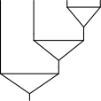

Satex is a [string diagram](https://en.wikipedia.org/wiki/String_diagram)
generator for LaTeX. It takes as input a formula such as
```
(1 * delta) * (mu * 1)
```
(appropriately written in the LaTeX file) and produces a diagram such as


generated using TikZ.

It is inspired from [Catex](https://webusers.imj-prg.fr/~yves.guiraud/) (see
also the
[documentation](https://webusers.imj-prg.fr/~yves.guiraud/catex/catex.pdf)) for
which the sources where unfortunately not available.

In case you have a problem, please file a bug report at the following url:
<https://github.com/smimram/satex/issues>.

# General usage

In order to use satex in your LaTeX file, you should first include the style
file:

```
\usepackage{satex}
```

You should then declare the operators you want to use in the format

```
\deftwocell[options]{name : m -> n}
```

which declares an operator named `name` with `m` inputs and `n` outputs. The
options in `options` allow changing the way the operator is displayed and so
on. For instance,

```
\deftwocell[triangle]{mu : 2 -> 1}
```

will declare the following operator:


One can then generate diagrams by using commands of the form

```
\twocell{expr}
```

where `expr` is a categorical expression involving operators and identities. The
identity on _n_ wires is simply written as the corresponding number and
compositions are noted `*`: toplevel compositions are vertical ones and those
inside parenthesis are horizontal. For instance

```
\twocell{(2 * mu) * (1 * mu) * mu}
```

will typeset



A run of `pdflatex` on your file, say `file.tex`, will generate a file named
`file.satex`. You should then run

```
satex file.satex
```

which will generate a file `file.satix` containing the generated TikZ figures,
which are automatically included in the next run of `pdflatex` on your file.

# Options for operators

## Shapes

Various shapes are available for operators:

- `circle` (default one): 
- `triangle`: 
- `rectangle`: 
- `mergeleft` / `mergeright`:  / 
- `cup` / `cap`:  / 
- `blank`: 

## Labels on operators

Labels are indicated between double quotes. For instance

```
\deftwocell[triangle,"\mu"]{mu : 2 -> 1}
```

typesets


## Labels on wires

The special operator `label` allows adding labels to wires. The option `d` or
`u` indicates whether the labels should be put down or up, and the above syntax
is used for labels. For instance

```
\twocell{label[d,"x","y"] * mu * label[u,"z"]}
```

typesets


## Inline operators

You can use operators which have not been declared beforehand: the syntax is `(m
-> n)[options]` to use an operator with `m` inputs, `n` outputs and given
options. For instance,

```
(1 * (1 -> 2)[rectangle,"f"]) * ((2 -> 1)["g"] * 1)
```

typesets


